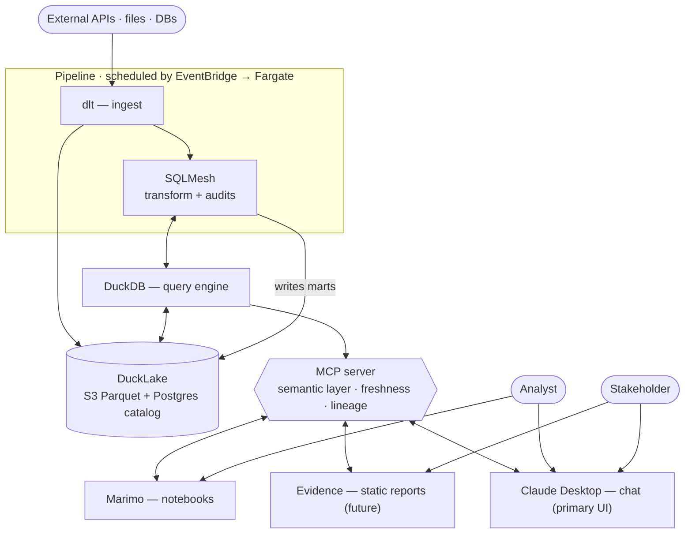

# Bleeding edge data stack
Agent-friendly lakehouse. Chat as primary UI. Everything as code.

**Reading it.** Pipeline (top) ingests with dlt and transforms with SQLMesh, scheduled together by EventBridge + Fargate. Data lives in DuckLake (S3 Parquet + Postgres catalog), queried by DuckDB. The MCP server sits on top of DuckDB and is the protocol layer every consumer attaches to — chat, notebooks, static reports, and any future UI. Analysts use chat and notebooks; stakeholders use chat and (future) static reports.

## Ingestion
- dlt.

## Storage
- DuckLake.
- S3 + RDS (PostgreSQL).

## Compute
- DuckDB.

## Transformation
- SQLMesh.

## Quality
- SQLMesh audits.
- Soda if needed.

## Orchestration
- EventBridge + Fargate.
- Dagster/Prefect if future need.

## Consumer interfaces
- MCP server exposing the semantic layer, freshness, and lineage. Start with the semantic layer.
- Primary surface for every consumer — chat agents, Marimo, Evidence, and any future custom UI all attach here.

## Chat surface
- Claude Desktop.

Future:
- Custom chat UI.

## Notebooks
- Marimo.

## Static reports
- Evidence.
